# Manual de usuario de servicios web para herramientas de RegulonDB usando GraphQL
***

## Índice

- Introducción 
    - ¿Que son los servicios web?
    - ¿Que son las APIS?
- Estructura del proyecto
- ¿Cómo añadir servicios de RegulonDB? 
    - Naturaleza de los datos
    - Carpeta a la que se va a dirigir
    - Consideraciones de armado
- Servicio web para DTT (Closed Tools)
    - Schema
    - Model 
    - 6Resolver
    - Controller
    - ¿Cómo usar el servicio?
- Servicio web para Coexpression (Open Tools)
    - Schema
    - Model
    - Resolver
    - Controller
    - ¿Cómo usar el servicio?
- Apollo Federation
    - Requisitos
    - ¿Cómo usar Apollo Federation?

---

## Introducción 

El siguiente documento tiene como objetivo describir todos los componentes de los servicios web para las herramientas Drawing Traces Tool y Coexpression del sistema de RegulonDB, así como la implementación de Apollo Federation para estructurar y clasificar todos los servicios pertenecientes a RegulonDB y como es que los usuarios pertenecientes al PGC deben de usarlos.

### ¿Qué son los servicios web? 

Los servicios web hacen referencia a un sistema software diseñado para el soportar la interacción entre maquinas mediante una red interoperable, y que tienen una interfaz descrita en un formato que puede ser procesado por un equipo informático.
Estos servicios permiten el intercambio de mensajes empleando diferentes arquitecturas (SOAP o REST entre las más comunes) y naturalmente transmitidos usando una serialización XML sobre protocolos HTPP y otros estándares web.

### ¿Qué son las APIS?

Las APIS a diferencia del servicio web es una interfaz que permite que dos aplicaciones puedan establecer comunicación y para lograr eso, no se limita a protocolos HTTP, sino que puede emplear cualquier medio de comunicación.

Estas APIS pueden comunicar aplicaciones que no necesariamente tienen que estar en la web, pero cuando es el caso, entran en función los servicios web. Bien se puede decir que no todas las APIS son un servicio web, pero los servicios web si son APIS.

Las APIS no se limitan a las arquitecturas REST o SOAP, para efecto de este proyecto se empleará la tecnología de GraphQL y como van a estar desarrolladas en un entorno web se convierten en un servicio web.

Esta graphql API permitirán establecer conexión con las bases de datos y consultar la información requerida por el usuario.

---

## Estructura del proyecto

Este proyecto contempla dos servicios web para diferentes herramientas de RegulonDB, por lo que se definió una estructura de como iba a estar contenido. Los servicios se dividieron en dos tipos.

1. Abiertos: Son aquellos servicios a los cuales cualquier persona que conozca de su existencia puede acceder a ellos esto significa que la interfaz (playground) estará habilitada para los usuarios.

2. Cerrados: Estos servicios solo podrán ser consumidos por las herramientas de RegulonDB y su interfaz (playground) estará deshabilitada.

La arquitectura permite clasificar los servicios desarrollados en este proyecto de acuerdo con su tipo, DTT pertenecerá a los servicios cerrados pues será consultado únicamente por RegulonDB mientras que Coexpression será abierto y podrá ser consultado por el usuario.

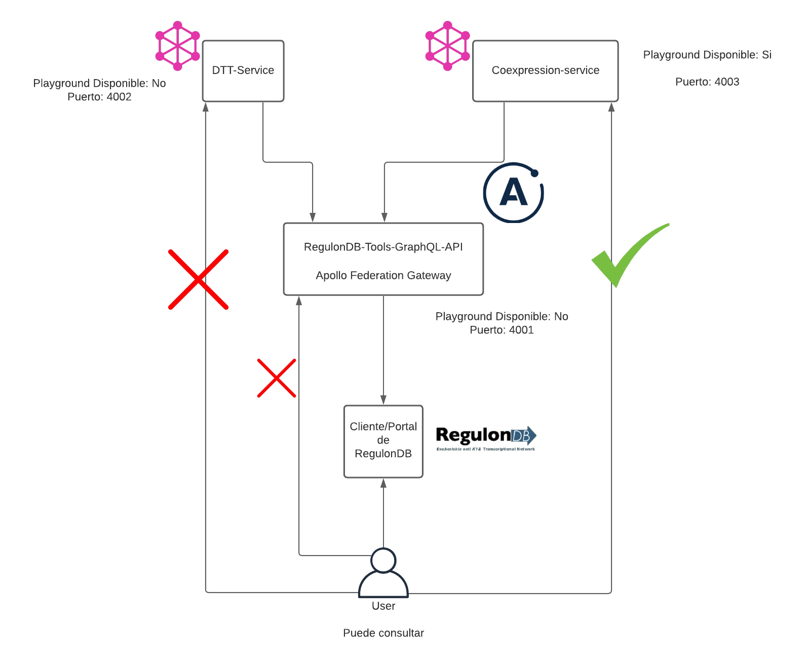

Cada servicio estará contenido dentro de su propio directorio con sus respectivos archivos y se puede visualizar de la siguiente manera.
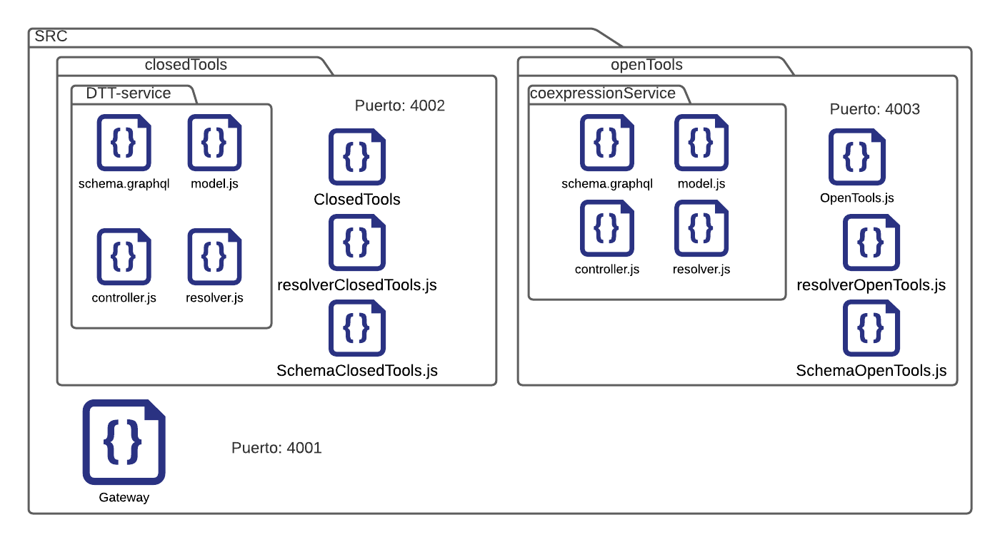

---

## ¿Cómo añadir servicios de RegulonDB?

Para que una API de graphql funcione sistemáticamente necesita de ciertos archivos que permitirán consultar o modificar la información de una base de datos.

- **Schema graphql**: Definirá las capacidades que tendrá el servicio web, contendrá queries para consultar la información de la base de datos (equivalente a SELECT de SQL) o mutations para modificar los datos (equivalente a UPDATE, DELETE, INSERT).
- **Resolver**: Se definen las soluciones que obtendrá cada query cuando sean solicitados y regresará la información a graphql.
- **Model**: Modela las colecciones de las bases de datos en objetos.
- **Controlador**: Contiene las funciones expuestas en el resolver para consultar la información de la base de datos y devuelve un objeto en formato JSON.
- **Index**: Este archivo será el encargado de inicializar el servicio el cual empleará los esquemas GraphQL y resolvers definidos.

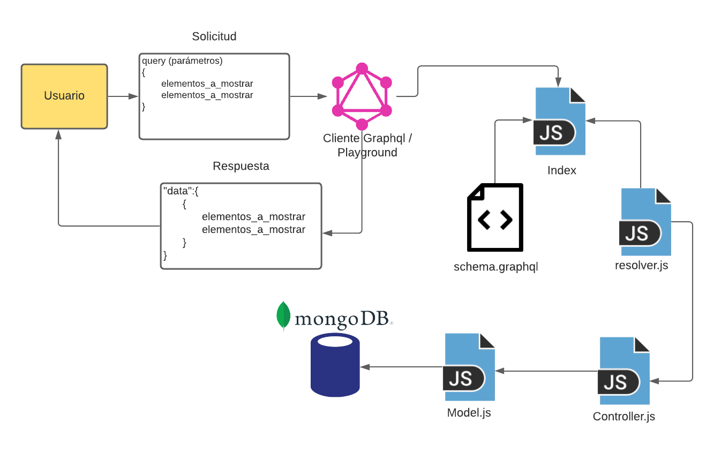

Para añadir futuros servicios web de RegulonDB se deben de tener los siguientes puntos a consideración para que estos puedan ser integrados a la arquitectura con la que se esta trabajando.

- **Naturaleza de los datos:** Se identifica el uso que van a tener los datos, si estos van a tener un funcionamiento fuera de las herramientas de RegulonDB.

- **Carpeta a la que se va a dirigir:** Una vez identificada su naturaleza se procede a integrar el servicio dentro de una de las clasificaciones:

  1. *Open Tools:* Aquí se encuentran todos los servicios que pueden tener un uso fuera de las herramientas de RegulonDB.
  2. *Closed Tools:* En esta carpeta están localizados aquellos servicios exclusivos para las herramientas de RegulonDB y que la información obtenida es específica y no tiene un uso funcional fuera de estas.

- **Consideraciones de armado:** Para poder definir un servicio web dentro de la arquitectura implementada de Apollo Federation se requiere modificar el archivo index de cada servicio *open* y *closed*.

  Dentro de la función que construye el servidor de Apollo existe una propiedad denominada ***schema***, esta propiedad recibe un esquema de Graphql.

  Se importa el modulo de "*buildFederatedSchema*" de Apollo Federation y se crea una variable que contiene una función con el modulo la cual contendrá dentro de un arreglo de un elemento los **TypeDefs** y **Resolvers** con la siguiente sintaxis

  ```javascript
  const federatedSchema = buildFederatedSchema([{
      typeDefs: gql`${typeDefsClosed}`,
      resolvers: resolversClosed
  }]);
  
  ```

  Una vez creada la variable se le envía al parámetro de ***schema*** en el servidor de Apollo:

  ``` javascript
  const server = new ApolloServer({
  	playground: true,
  	schema: federatedSchema
  })
  ```

  

---

## Servicios web para DTT (Closed Tools)

Este servicio es el encargado de extraer la información que será entregada a la herramienta de Drawing Traces Tool (DTT) con la cual podrá dibujar los elementos genéticos. El servicio va a recibir los siguientes parámetros.

- Un par de coordenadas genéticas asociadas la genoma E.coli.
- Orientación del DNA: reverse, forward, all. De acuerdo con la opción seleccionada deberá regresar los elementos genéticos con la orientación correspondiente. En caso de seleccionar “all” se devolverán los elementos con ambas orientaciones.
- Lista de los elementos genéticos: operon, gene, promotor, tf_binding_site, srna, binding_site, riboswitches, terminator, translation_attenuator, transcription_attenuator, ppGpp.

Para la construcción de este servicio se tiene la colección de dnaFeatures en su versión 0.2, la cual puede cambiar en cualquier momento, en MongoDB a la cual se establecerá la conexión, la siguiente imagen muestra como está compuesta dicha colección.

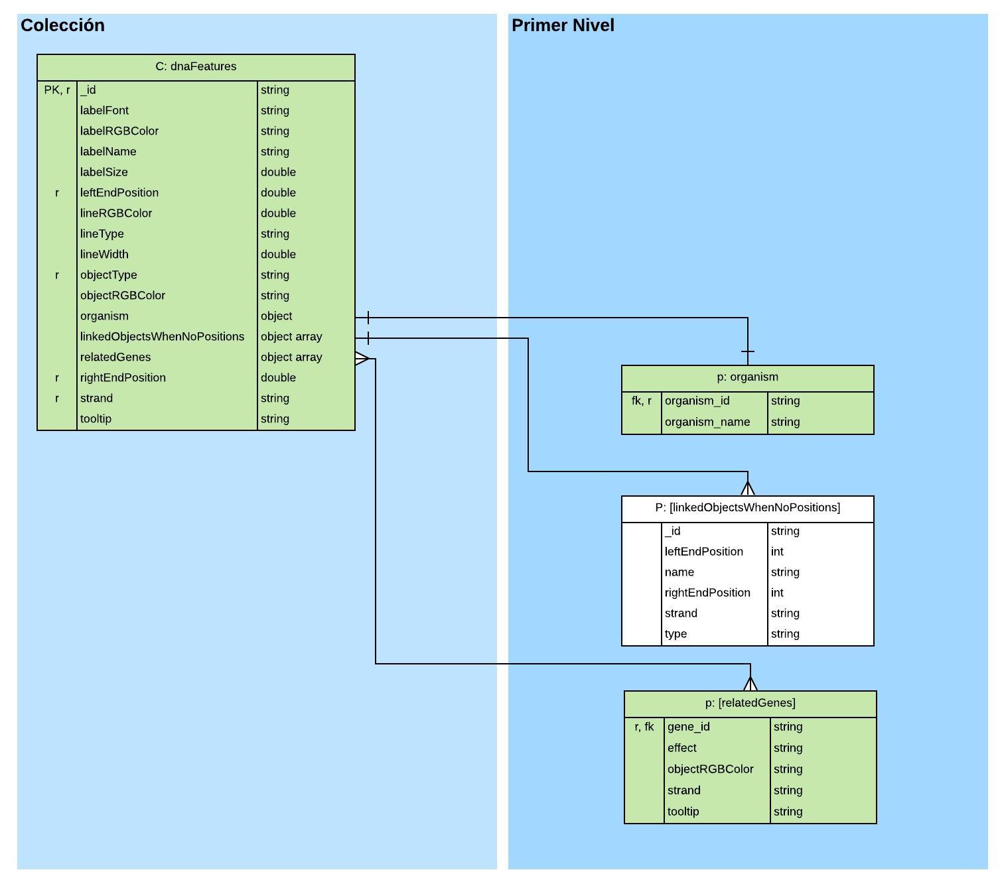

### Schema

En el esquema Graphql se generan TYPES para todos los elementos de la colección especificando el tipo de dato con el que trabajan. El type principal engloba todos los elementos de la colección y este se conectará con el query para mostrar la información requerida por el usuario.
El query se establece en este archivo como un “*type query*” e indica los parámetros que va a recibir, así como el tipo de dato que va a retornar. El query “***getGeneticElementsFromInterval***” obtiene un arreglo de objetos dentro de los cuales se encontrarán todos los elementos de la colección.

### Model

El archivo model exporta un objeto que modela todos los elementos de la colección de MongoDB utilizando el ODM mongoose , sin este archivo no se puede acceder a la base de datos, se recomienda que se genere un archivo para cada colección, ej. ***dttModel.js***

### Resolver

Exporta un objeto que contendrá la solución, dentro de el esta definido el query “***getGeneticElementsFromInterval***” con los parámetros establecidos y los asigna a la función del controlador encargada de realizar la consulta. Devuelve los resultados en un formato JSON a graphql para que puedan ser visualizados.

### Controller

Se establecen las funciones que conectan a la base de datos para realizar las consultas pertinentes de acuerdo con los parámetros enviados.

- LeftEndPosition: Indica la posición inicial del rango.
- RightEndPosition: Indica la posición final del rango.
- Strand: Orientación de los genes, valor por defecto “*both*”.
- ObjectType: Lista de elementos genéticos, valor por defecto “*all*”.
- Covered: Opción que indica si los elementos se encuentran contenidos únicamente dentro del rango o no, valor por defecto “*false*”.

**Covered**
Este parámetro va a indicar varias situaciones que cambiaran la lógica de la consulta, cuando el valor es “false” indica que los genes:

- Inician dentro y terminan fuera del rango establecido.
- Inician fuera y terminan dentro del rango establecido.
- Inician y terminan fuera, pero las posiciones pasan por el rango establecido.

Cuando el valor es *“true”* indica que los genes:
- Se encuentra dentro del rango establecido.


### ¿Cómo usar el servicio web?

Los requisitos para poder ejecutar el servicio son los siguientes:

1. Versión actualizada de node.js
2. Tener un IDE instalado, recomendado VS Code (opcional)

En la terminal (propia del sistema operativo o de VS Code) se genera una nueva ubicación que va a alojar el proyecto.
El proyecto se encuentra en el repositorio de GitHub de la UNAM, RegulonDB-ServiciosWeb-Daniel. En la terminal, una vez generada la nueva ubicación, se ejecuta el siguiente comando:
```shell
Git clone https://github.com/regulondbunam/RegulonDB-ServiciosWeb-Daniel
```

Posteriormente, se necesitan instalar todas las dependencias con las que trabaja. Una vez ubicado en la carpeta del proyecto, se ejecuta el comando:
```shell
$ npm install
```
Todas las dependencias se instalan dentro de una carpeta con el nombre de node_modules. 

Para inicializar el servicio se ejecuta el comando:
```shell
$ npm run service:closedTools
```

Este comando esta definido en un script dentro del archivo “***package.json***”. Una vez ejecutado en la consola va a mostrar una dirección IP con el formato http://localhost:4002/graphql en caso de estar siendo ejecutado de forma local.


Al ingresar a la dirección asignada se muestra la interfaz de playground, la cual tiene definidos todos los elementos pertenecientes al servicio, es decir los types y querys generados en el schema. En la pestaña docs se encuentra toda la información respecto al servicio web y como construir el query.

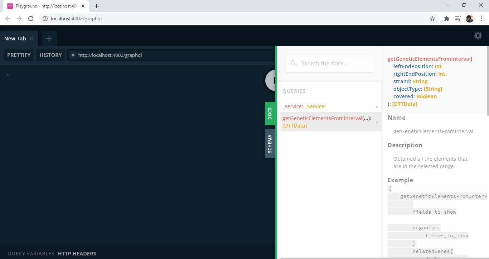


En la documentación autogenerada (docs) se encuentran los parámetros que podemos definir para el query dependiendo de que se quiera consultar. La solicitud se realiza en tipo JSON y se escribe el nombre del query seguido de los parámetros, y posteriormente los datos que se quieren visualizar.
Los parámetros del query tienen valores por defecto, a excepción de las posiciones, esos son los únicos que tienen que ser definidos obligatoriamente por el usuario. En la siguiente imagen se muestra una consulta de aquellos elementos que se encuentren en un rango de 100 a 1000.

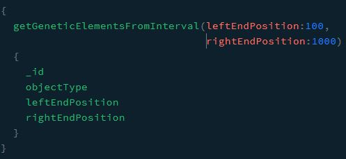


Ya teniendo la consulta, se ejecuta presionando el botón central de la interfaz y obtendremos una respuesta en formato JSON con un arreglo de objetos con los valores que se han solicitado.

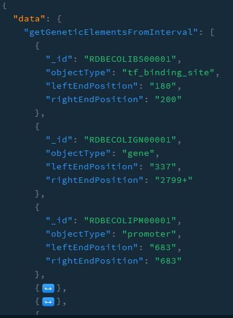

---

## Servicio web Coexpression (Open Tools)

Los datos de coexpression representan la expresión de genes en diferentes condiciones, los cuales se han calculado sobre un score entre cada par de genes, de tal forma que dicho score representa el grado de variabilidad en la expresión de los genes comparados. Entre menor sea el número menor será la variabilidad, es decir, la expresión entre los genes es muy parecida, y entre más crezca el numero mayor será la variabilidad.
El servicio de coexpression permite construir una matriz la cual contiene aproximadamente 4600 genes.

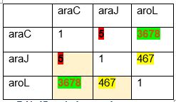


El servicio web recibirá contendrá dos querys pues la herramienta se divide en dos secciones. Un query (***getTopCoxpressionRanking***) va a permitir consultar una lista de aquellos elementos que tengan menor variabilidad con un gen determinado, mientras que el segundo query (***getRankFromGeneList***) será el encargado de construir la matriz de HeatMap.

El servicio web se conecta a la colección de geneCoexpression en su versión 0.2 que se muestra en la siguiente imagen.

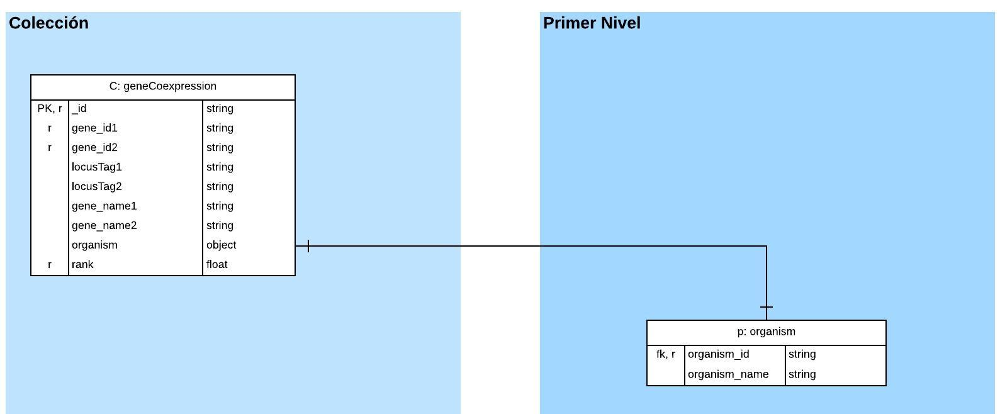

### Schema

Se genera el esquema graphql en base a la colección de coexpression en su versión 0.2 junto con todos sus campos incluidos los dos querys con los que va a funcionar ***“getTopCoexpressionRanking”*** y ***“getRankFromGeneList”*** y el type que va a retornar. En una entrevista con el cliente se definió un nuevo type que resumiera la respuesta para los querys debido a que la información resulta ser redundante por lo que se generó el type CoexpressionResume que se muestra en la siguiente imagen. Los campos de este type adquieren el valor de aquellos genes diferentes a los que se tienen en la consulta.

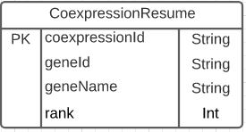

### Model

En base a la colección geneCoexpression v0.2 se modela un objeto con mongoose el cual nos va a permitir acceder a todos los elementos de la base de datos. Funciona de la misma manera que el model en el servicio de DTT y tiene el nombre de **coexpressionModel.js** 

### Resolver

Exporta un objeto que contendrá la solución, dentro de él están definidos los querys ***“getTopCoexpressionRanking”*** y ***“getRankFromGeneList”*** con los parámetros establecidos y los asigna a la función del controlador encargada de realizar la consulta. Devuelve los resultados en un formato JSON a graphql para que puedan ser visualizados.
El resolver será el encargado de mapear la información obtenida por el controller mediante una función la cual recibe el objeto de respuesta y el campo indicado será asignado a cada elemento del type CoexpressionResume. 
El type CoexpressionResume no existe en la colección de MongoDB, sino que es creado para poder filtrar la información mostrada para el usuario, cabe resaltar que el type de la colección sigue definido por si se necesita en algún futuro

### Controller

Contiene las funciones que se van a ejecutar para satisfacer la solicitud del resolver, en este archivo se encuentra toda la lógica de conexión y consulta a la base de datos.

El query ***“getTopCoxpressionRanking”*** recibirá los siguientes parámetros.
- Gene: Nombre del gen al cual se le va a consultar su top de genes con menor variabilidad entre sí.
- Límite: Indicará la cantidad de genes a solicitar, su valor máximo y por defecto es 50.
- ID: Este parámetro es opcional y permitirá realizar la consulta por su campo ID en vez de nombre.

Para el query ***“getRankFromGeneList”*** recibirá los siguientes parámetros.
- Gene: Nombre de un gen.
- GeneList: Lista del top 50 de genes de un gen a comparar.
- ID: Parámetro opcional que permite realizar la consulta por el campo ID.
- IDList: Parámetro opcional que permite hacer las comparaciones por el campo ID. 

Existen dos formas de ejecutar este query, por nombre o por ID, y estas tienen que ser consistentes al realizar la consulta, es decir, que ambos parámetros tienen que ser del mismo tipo.


### ¿Cómo usar el servicio?

Este servicio tiene los siguientes requisitos.

1. Clonar el repositorio de GitHub.
2. Instalar las dependencias del proyecto con `$ npm install.`

Para inicializar el servicio de Coexpression se ejecuta el siguiente comando:
```shell
$ npm run service:openTools
```

En la terminal aparecerá un mensaje con la dirección en la cual se va a alojar el servicio, de ser local se le asignara al puerto 4003. Al ingresar a la URL se mostrará la siguiente interfaz con su respectiva documentación.

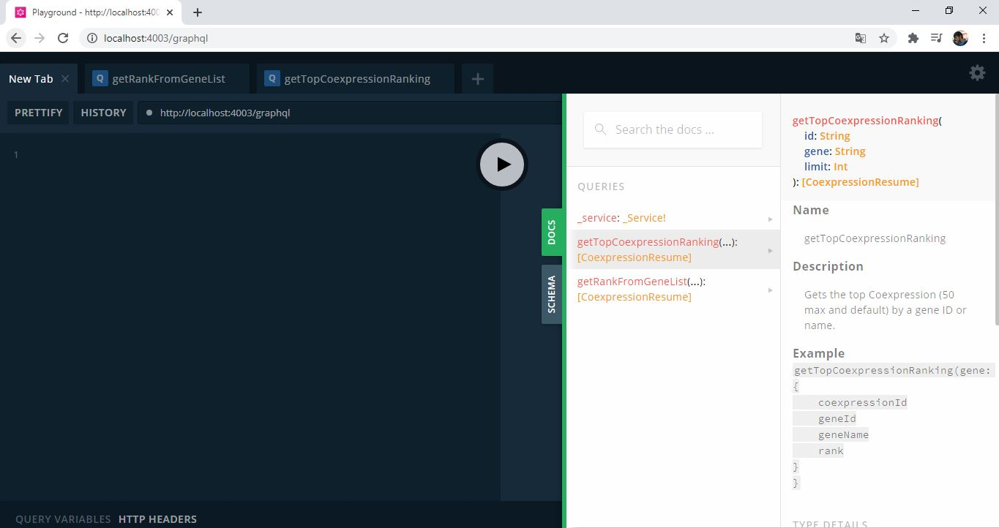


Para el ***“getTopCoexpressionRanking”*** se coloca el nombre del query seguido del parámetro que se le enviaran y los datos que se necesitan, siempre en tipo JSON.

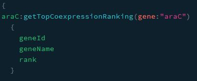


Otra forma de realizar la consulta es cambiar el parámetro nombre por un ID, por ejemplo.

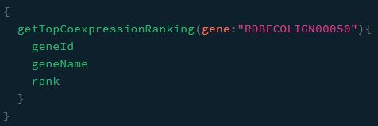


Una vez ejecutada la consulta devuelve los documentos que coinciden en la búsqueda realizada en el mismo formato JSON.

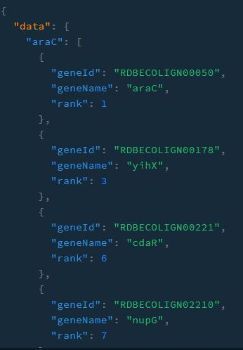


Para el query ***“getRankFromGeneList”***, se envía el nombre o ID de un gen como primer parámetro, y una lista de nombres o ID la cual se puede obtiene del query ***"getTopCoexpressionRanking"***.

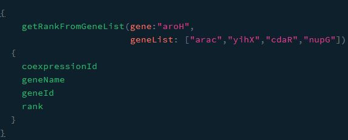


Se ejecuta la consulta y obtiene los documentos en donde *“gene”* coincide en uno de los campos “gene_name1” o  ”gene_name2” de cada elemento de *“geneList”*.

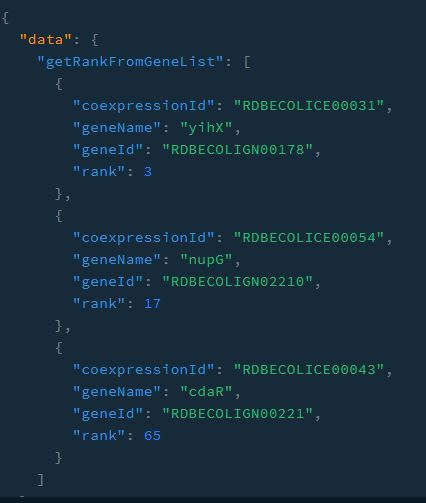


---

## Apollo Federation

Esta herramienta perteneciente a Apollo permite tener diferentes esquemas graphql definidos en una puerta de enlace, es decir, que desde ahí podemos tener acceso a los diferentes servicios que se establecieron dentro de una lista.

Esto facilita el mantenimiento y control de los distintos servicios web de las herramientas de RegulonDB pues todos tienen que estar contenidos en la misma carpeta y pueden ser consultados sin estar levantando cada servicio por su cuenta.


### Requisitos

La instalación de la dependencia viene dentro de los paquetes instalados vía NPM por lo que no es necesario realizar alguna instalación extra.

Aun así, hay puntos a considerar para poder ejecutar esta herramienta correctamente.

1. Los esquemas de graphql de todos los servicios tienen que ser de tipo “federatedSchema”, esta configuración se añade en los archivos de index de cada servicio al momento de crear el servidor.

   

2. Para que se pueda ejecutar tienen que estar ambos tipos de servicios (abiertos y cerrados) inicializados para que la puerta de enlace pueda conectarse a sus direcciones en donde se están ejecutando.

   


3. El archivo “Gateway.js” tiene que contener una lista de servicios junto con las direcciones en las cuales estos son inicializados. En la siguiente imagen se muestra un ejemplo de la lista de servicios definida, funciona tanto para servicios locales como para remotos siempre y cuando sean definidos en esta lista.

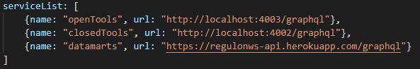


### ¿Cómo usar Apollo Federation?

Una vez cumplidos los requisitos anteriores, se tiene que definir un script que inicialice el archivo *“gateway.js”*.

Antes de iniciar el *gateway*, es necesario que estén encendidos los servicios Cerrados y Abiertos, estos pueden inicializarse en concurrencia con el siguiente comando:
```shell
$ npm run start:services
```

Una vez inicializados los servicios se ejecuta el siguiente script: `$ npm run gateway`

Se genera una dirección que esta habilitada en el puerto 4001 y ahí se muestra la interfaz de playground donde se podrán utilizar los querys definidos en cualquiera de los servicios que se dieron de alta en la lista.

En el ejemplo se puede observar que se encuentran los querys de los dos servicios anteriores más los querys contenidos en el servicio remoto de heroku.

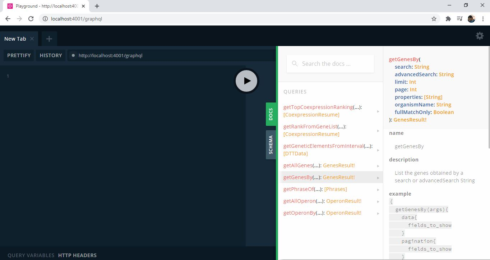


Para consultar la información de los querys se sigue el mismo formato que con los servicios anteriores. 

Para efectos de prueba de funcionamiento del gateway se consulta la información con uno de los querys añadidos recientemente.

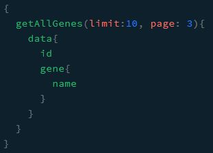


El query anterior no esta definido en los servicios de DTT y Coexpression, este pertenece a un servicio externo a los desarrollados en el proyecto, pero con Federation se puede consultar la información de la misma manera como si estuviera de forma local.

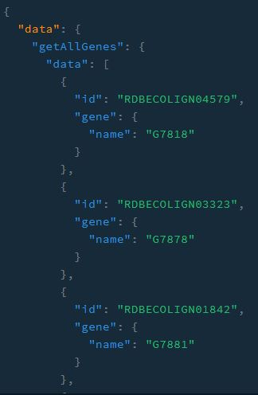


Para detener cualquiera de los servicios inicializados, sobre la terminal se ejecuta el comando:

```
Ctrl + C
```

